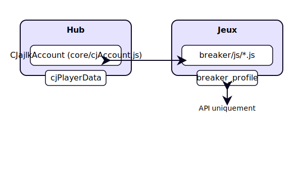

# CJajlkGames

Hub web de l’écosystème CJajlkGames (jeux, applications et boutique), déployé via GitHub Pages.

## Aperçu

Le projet regroupe :
- un hub principal de navigation,
- des jeux web (notamment Attrape et Breaker),
- des applications externes liées au hub,
- des ressources partagées (assets, scripts, styles),
- une documentation d’architecture.

## Arborescence principale

- `index.html` : page d’entrée du hub.
- `assets/` : styles globaux, scripts et médias communs.
- `games/attrape/` : jeu Attrape.
- `games/breaker/` : jeu Breaker.
- `shop/` : boutique CJ.
- `core/` : modules communs (compte, moteur).
- `docs/` : documentation technique.

## Exécution locale

Projet statique HTML/CSS/JS : aucun build requis.

### Méthode recommandée (VS Code)
1. Ouvrir le dossier du projet.
2. Démarrer un serveur local (ex. Live Server).
3. Ouvrir la racine sur `index.html`.

## Déploiement

Le dépôt est prévu pour GitHub Pages.

- Hub : `https://cjajlk.github.io/cjajlkGames/`
- Applications liées depuis la section Applications (ex. Focus Chronicles, Relaxation App)

## Architecture

Documentation détaillée : [docs/architecture.md](docs/architecture.md)

## Objectif

Maintenir une base stable, claire et évolutive pour l’ensemble de l’écosystème CJajlkGames.
