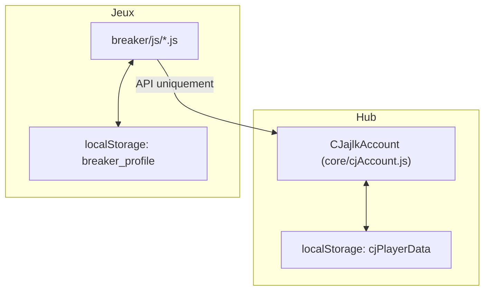

# Architecture de l’écosystème CJajlkGames

## Schéma général

## Règles strictes d’écriture/lecture

- Seule l’API `CJajlkAccount.add` (core/cjAccount.js) peut modifier le solde CJ universel.
- Aucun jeu ne doit écrire directement dans `cjPlayerData`.
- Aucune lecture/écriture croisée entre profils locaux et le hub.
- Les monnaies locales restent strictement dans leur jeu.

## Séparation Hub / Jeux

- **Hub** : gère uniquement les CJ universels, via `cjAccount.js` et `cjPlayerData`.
- **Jeux** : gèrent leurs monnaies et profils localement (ex : `breaker_profile`).
- Communication entre jeux et hub uniquement via l’API publique CJajlkAccount.

## Responsabilités de CJajlkAccount

- Source de vérité unique pour le solde CJ universel.
- Fournit des méthodes d’ajout, lecture, statistiques CJ.
- Garantit l’intégrité et la centralisation des données CJ.
- Empêche toute modification directe par les jeux.

---

Cette documentation garantit la stabilité, l’évolutivité et la lisibilité de l’écosystème CJajlkGames sur le long terme.
